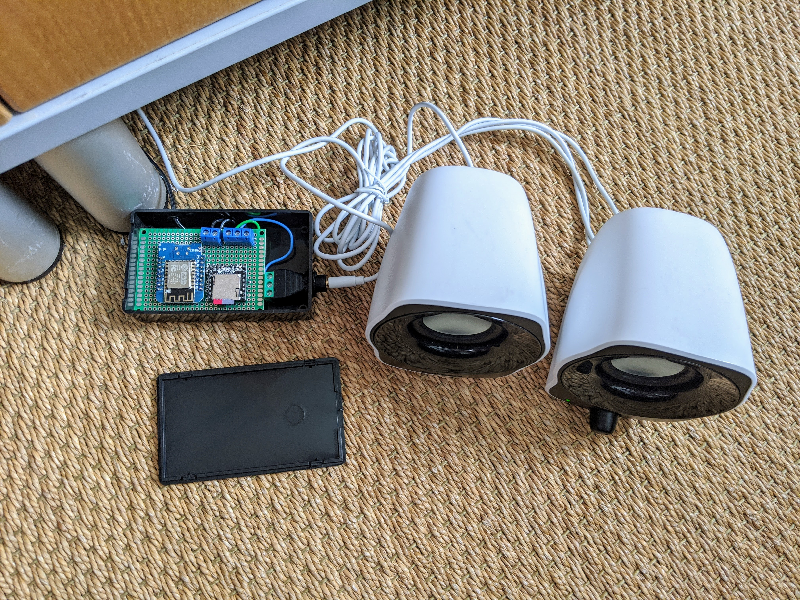

# DIY Video Doorbell with Voice Response
### Based on ESP32 Camera & DFPlayer Mini with Home Assistant and ESPHome

This has been a long running project to create a cloudless video doorbell with notifications & voice responses. It was important to me that the doorbell itself looked as professional as possible.

## Features

### Click for [DOORBELL DEMO VIDEO](https://youtu.be/WeC6uWMYbTs)

- Plays audible ("ding dong") and visual (blinking LED) feedback when some presses doorbell button
- Calls service to play doorbell chimes downstairs and upstairs in the house
- Sends actionable notifications with a camera snapshot to my and my partner's phones. Actions initiate pre-recorded voice responses which are player through the doorbell itself:
  - "Someone is coming to the door."
  - "Sorry. No one can come to the door right now."
  - "Sorry. No one can come to the door right now. Please drop the parcel behind the date at the right of the house."
- Pop up a live view from the doorbell camera on two wall-mounted tablets in the house, with the same voice response options plus a button to play an alarm sound on a loop until stopped. This same view also opens the Home Assistant Companion App on our phones if we tap the notification.

### Click for [WALL MOUNTED POP-UP DEMO VIDEO](https://www.youtube.com/watch?v=FklyIyLAvNg)

## Building the doorbell

The design of the doorbell is very specific to my need where the doorbell had to fit on the narrow doorframe and be positioned at an angle.  On the plus side, it's well protected from rain, so I didn't have to make it waterproof.

If you have the luxury of space, consider designing your own housing that is wider. Internal assembly is very tight in this design.

I've wired a 5V (actually USB) cable through the doorframe so that the doorbell has constant power. The cable is not visible inside the house.

### Mechanical parts

- [Custom 3D printed housing & printed camera holder designed in OnShape](https://cad.onshape.com/documents/9f03d6aa3c65d7100cf633ae/w/a58196c250d56a4f8fff0bc5/e/e6154cd1baae63dc528d893a)
  (Note that this design is very specific to my needs, and the files are not particularly "clean" as a result of lots of trial and error.)
- [Lens insert 2mm x 16mm](https://www.ebay.co.uk/itm/293015681235)
- Custom 3mm acrylic front bezel (EPS file in repository) laser cut by [Razorlab](https://www.razorlab.online/)
- Piece of speaker fabric hot glued to the back of the speaker holes.

### Electrical/electromechanical parts
The electrical design is straightforward. The difficult bit was to fit everything into the small amount of space I had available.

- [ESP32 Camera](https://esphome.io/components/esp32_camera.html), specifically [this one](https://www.amazon.co.uk/ESP32-CAM-Bluetooth-Dual-core-Development-Wireless/dp/B07QS7VFMJ) with an external WiFi antenna
- [Camera module with long flex](https://www.banggood.com/LILYGO-TTGO-Camera-Module-OV2640-2-Megapixel-Adapter-Support-YUV-RGB-JPEG-For-T-Camera-Plus-ESP32-DOWDQ6-8MB-SPRAM-p-1478816.html)
- [DFPlayer Mini](https://esphome.io/components/dfplayer.html) with micro SD card
- [Speaker](https://www.amazon.co.uk/dp/B07DVFCJ34/ref=pe_3187911_185740111_TE_item)
- [Momentary button with LED](https://www.amazon.com/Ulincos-Momentary-Pushbutton-U19D1-Suitable/dp/B01LZ4OU04)

### Software

The system is based on Home Assistant with ESPHome. It uses a number of automations and scripts. I think that I've included all of the pieces in this repository. If not, please raise an issue.

### Dependencies

- [Home Assistant](https://www.home-assistant.io/)
- [ESPHome](https://esphome.io/)
- [browser_mod](https://github.com/thomasloven/hass-browser_mod)
- [button_card](https://github.com/custom-cards/button-card)
- [Home Assistant Companion app](https://play.google.com/store/apps/details?id=io.homeassistant.companion.android)
- [Notifications for Android TV](https://www.home-assistant.io/integrations/nfandroidtv/)

## Doorbell chimes

There are many ways that you could implement doorbell chimes. In past iterations, I've used Sonos speakers, Raspberry Pis with speakers attached and Google Home Minis. I'm finally happy with the current solution which is based on an ESP8266 Wemos D1 Mini paired with a DFPlayer Mini and connected to some amplified PC speakers, all running with ESPHome. 

Here's a pic. It's far from elegant looking, but both chimes are hidden from view in the house. And, it can go very loud with the amplified speakers. If you wanted to make something similar but self-contained, you could use a speaker similar to the one in the doorbell itself and put it together in one housing with the electronics.

An ESPHome configuration is in the repository, and here's a wiring diagram with options for amplified speakers via a 3.5mm jack or direct conenction to a speaker.

## To do

- Add video recording and snapshot archiving
